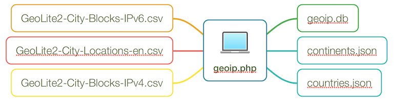

# geoip-wrapper
A PHP wrapper for MaxMind's GeoIP database

# Features
- No external dependencies
- Fast lookups
- Embedded database (SQLite)

# How it works
The script converts the CSV files into an SQLite database and JSON files.



# How to use
Download the CSV files from MaxMind's website ( http://dev.maxmind.com/geoip/geoip2/geolite2/ ), run $geoip->build() to create the SQLite database, then use $geoip->get(IP_ADDR) in your website / app.

Running the build script
```php
$geoip = new geoip();
$geoip->build();
```

Doing a lookup
```php
$geoip = new geoip();
$loc = $geoip->get("8.8.8.8");
echo json_encode($loc, JSON_PRETTY_PRINT);
```

# License
MIT
